# 🎓 HIT137 Group Assignment 3 – Image Editor & 2D Scrolling Shooter Game

Welcome to our repository for **Group Assignment 3** for the **HIT137 – Foundations of Computer Science** course at **Charles Darwin University**.

This project is divided into two distinct parts:

- 🖼️ A **Desktop Image Editing Application** using **Tkinter** and **OpenCV**
- 🎮 A **Scrolling Shooter 2D Game** using **Pygame**

---

## 📝 Project Overview

This project demonstrates key programming concepts learned in HIT137, including object-oriented programming, graphical user interface design, and basic game development. It consists of two main deliverables: an image editor application that supports loading, cropping, resizing, and saving images, and a scrolling shooter 2D game featuring player control, enemies, collectibles, and multiple levels.

---

## ⚙️ Prerequisites

- Python 3.8 or higher
- Tested on Windows 10 and Ubuntu 20.04
- Required Python packages listed in `requirements.txt`

---

## 📁 Repository Structure
- `github_link.txt` — Public GitHub URL for submission  
- `README.md` — Project documentation  
- `.gitignore` — Ignored files  
- `requirements.txt` — Required Python packages
- `HIT137_Assignment_3_S1_2025.pdf` — Assignment Questions 

- **HIT137-Group-Assignment-3/**  
  - **image_editor/** — Desktop application (Tkinter + OpenCV)  
    - `main.py` — Entry point  
    - `image_utils.py` — Image processing logic  
    - `gui.py` — GUI components and event handling  
    - **assets/** — Image and icon assets  
    - `README.md` — Image editor documentation  
  - **scrolling_shooter_game/** — Scrolling shooter 2D platformer (Pygame)  
    - `main.py` — Game loop and controls  
    - `button.py`
    - `config.py`
    - **img/** — Game image assets  
      - **background/** — Parallax scrolling backgrounds and environment scenes  
      - **enemy/** — Enemy character sprites  
      - **explosion/** — Explosion animation sprites  
      - **icons/** — UI icons such as health, lives, and ammo  
      - **player/** — Player character sprites for running, jumping, shooting  
      - **tile/** — Terrain tiles and platforms for level design  
    - **level_data/** — Saved level layout data (e.g., tile maps, enemy positions)  
    - **sounds/** — Sound effects and background music  
      - **audio/** — Audio files used for effects like shooting, jumping, and ambient music 

---

## 🖼️ Question 1: Image Editor App

A Python-based image processing application with intuitive cropping and transformation tools.

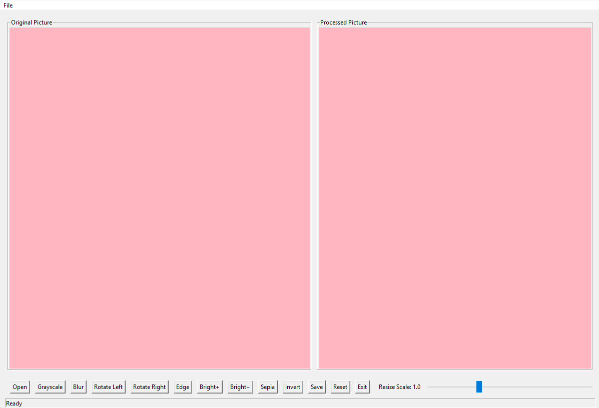  
*Main application interface*

## ✨ Features

### 🖌️ Core Functionality
- **File Operations**:
  - 📂 Load images from local system (JPG, PNG, BMP, TIFF)
  - 💾 Save processed images in multiple formats
- **Selection Tools**:
  - 🖱️ Draw rectangular crop area with mouse
  - 👀 Real-time selection preview
- **Image Processing**:
  - 🔍 Resize with interactive slider (10%-300%)
  - 🎨 Apply filters and transformations

### 🛠️ Editing Tools
| Feature | Icon | Description |
|---------|------|-------------|
| Grayscale | ⚫ | Convert to black and white |
| Blur | 🌫️ | Apply Gaussian blur |
| Rotate | 🔄 | 90° left/right rotation |
| Edge Detect | 🔍 | Highlight image edges |
| Brightness | ☀️ | Increase/decrease exposure |
| Sepia | 🟤 | Apply vintage filter |
| Invert | 🔳 | Negative color effect |

## 📸 Screenshots

### 1. Image Loading & Selection
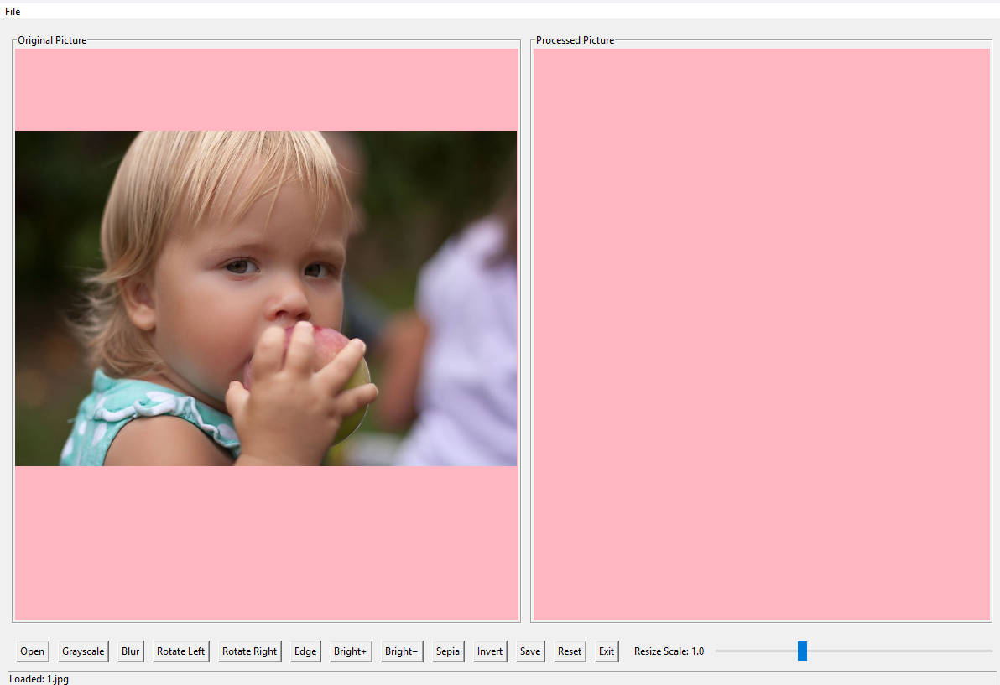  
*Selecting an image file*

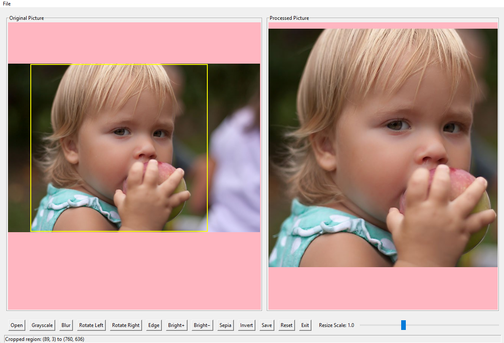  
*Interactive crop selection with live preview*

### 2. Editing Features
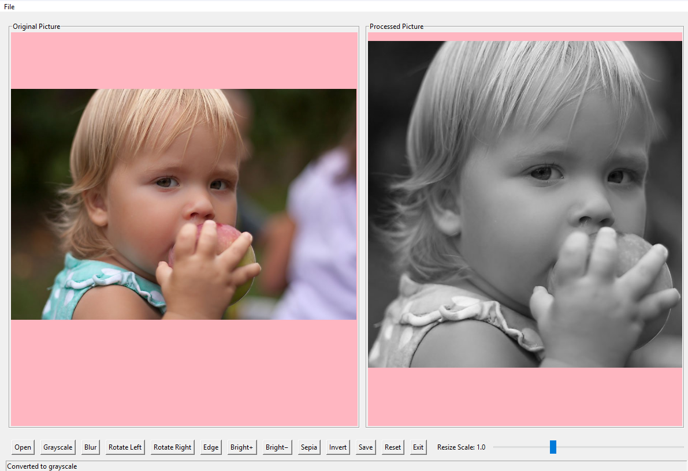  
*Black and white conversion*

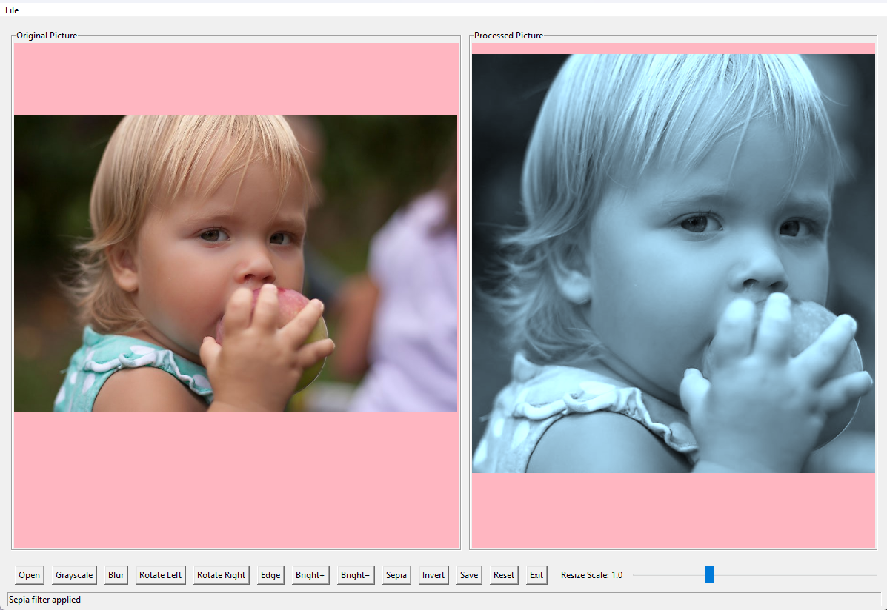  
*Vintage sepia effect applied*

### 3. Output Options
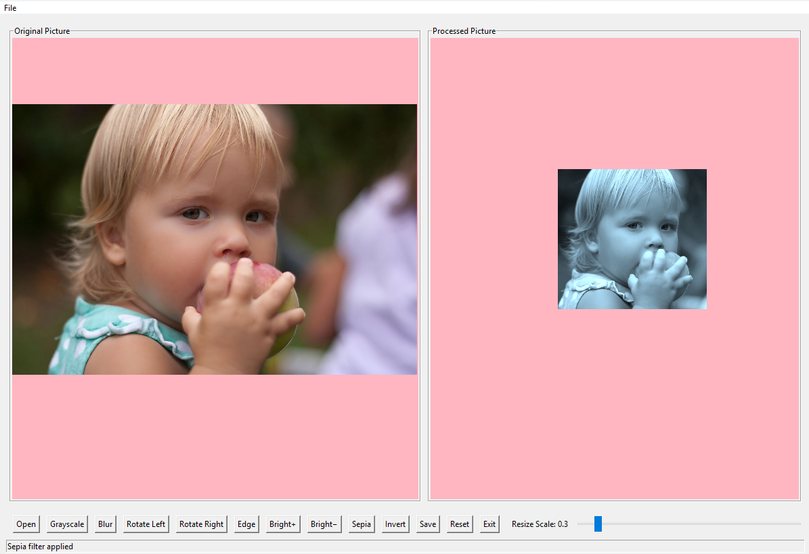  
*Adjusting output size with slider*

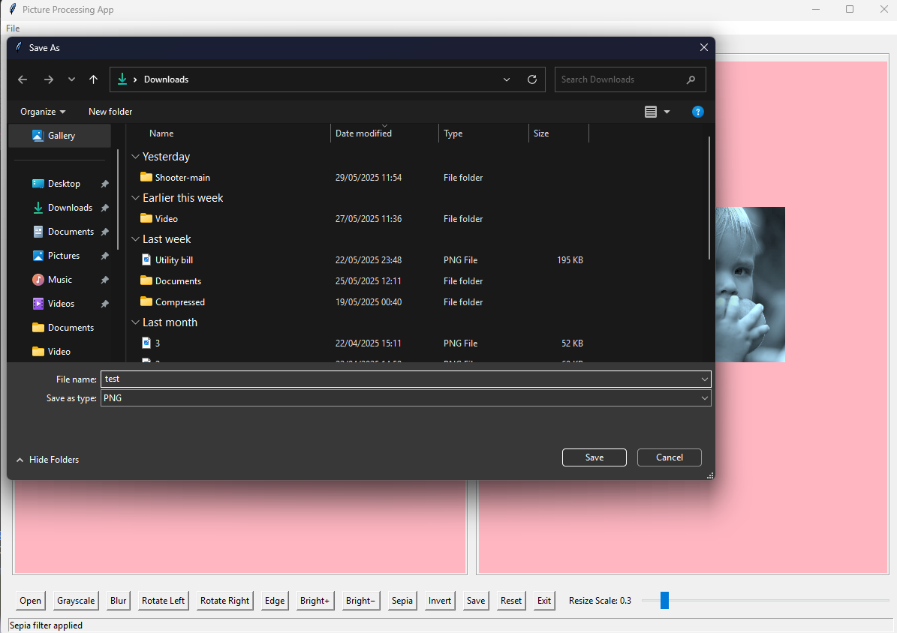  
*Saving in different formats*

### 🚀 How to Run
```bash
cd image_editor
python main.py
```
## 🎮 Question 2: Scrolling Shooter Game

### ✅ Features
- Player can run, jump, shoot
- Includes enemies and collectibles
- 3 unique levels with increasing difficulty
- Boss battle on final level
- Scoring system, player health, and lives
- Game Over screen with restart option

### 🕹️ Controls
| Key         | Action         |
|-------------|----------------|
| `D`         | Move Right     |
| `A`         | Move Left      |
| `W`         | Jump           |
| `Spacebar`  | Shoot          |

> Use these keys to control your character throughout the game. Timing and movement are crucial, especially during enemy encounters and boss battles!

### 📸 Game Previews

> _Below are a few screenshots showcasing the scrolling shooter game interface and gameplay._

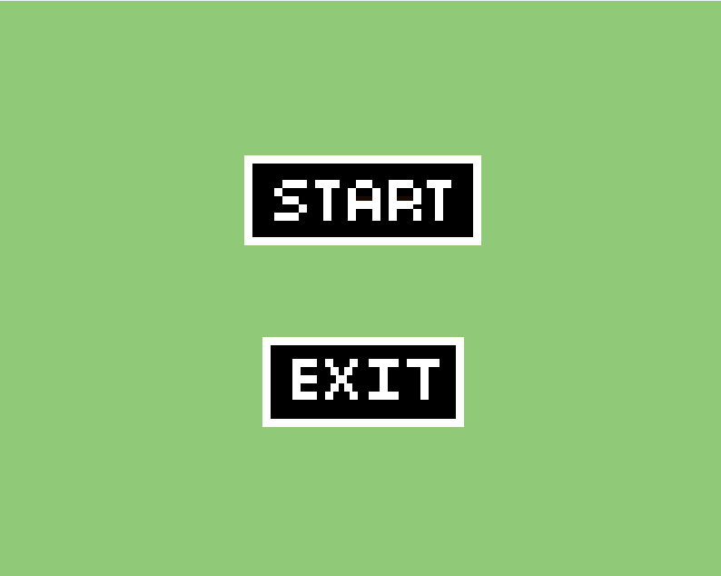
*Main menu screen with start and exit options.*

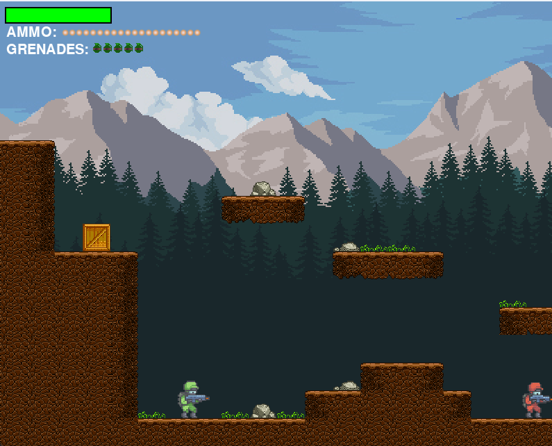
*Gameplay showing the player shooting and collecting items in Level 1.*

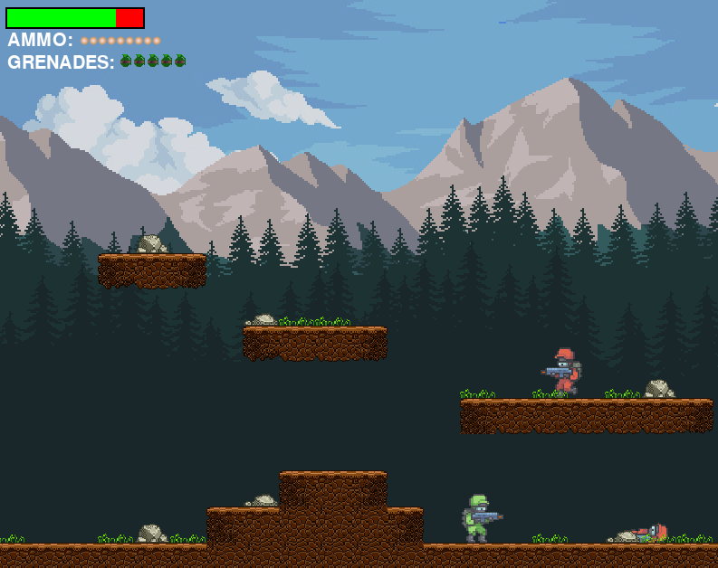
*Intense boss battle with explosions and projectiles.*

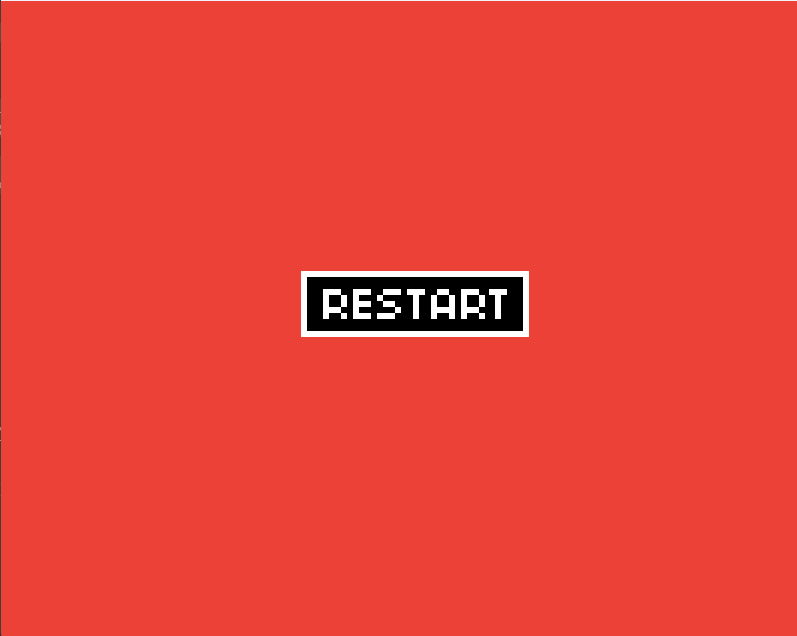
*Game Ending with Restart Option*

### 🚀 How to Run
```bash
cd side_scrolling_game
python main.py
```
---
## 📦 Installation & Setup

1. **Clone the Repository**

   ```bash
   git clone https://github.com/YOUR_USERNAME/HIT137-Group-Assignment-3.git
   cd HIT137-Group-Assignment-3
    ```
2. **Create Virtual Environment (Optional but Recommended)**

    ```bash
    python -m venv env
    source env/bin/activate    # On Windows: env\Scripts\activate
    ```
3. **Install Dependencies**
    ```bash
    pip install -r requirements.txt
    ```
---
## 👥 Group Members

| Name            | Student ID | Email |
|-----------------|------------|------ |
| Anish Machamasi | S389151 | anishmachamasi2262@gmail.com |
| Xiaoyu Wang  | S391743   |ginaxu1230@gmail.com |
| Veli Oz    | S392097   | veliozau@gmail.com |

---

## ✅ Submission Checklist

- [x] Public GitHub repository created
- [x] All code and documentation committed to GitHub
- [x] `github_link.txt` created with correct repo URL
- [x] Code and assets zipped for Learline submission

---

## ⚠️ Known Issues / Limitations

- Image editor currently supports JPG and PNG formats only.
- Undo/redo functionality not implemented in image editor.
- Game difficulty balancing ongoing; some levels may be more challenging.
- Keyboard shortcut customization is not available.

---

## 📄 License

This project is created as part of coursework for HIT137 at Charles Darwin University. It is for educational use only.

---

## 🙏 Acknowledgments

- [OpenCV](https://opencv.org/)
- [Pygame](https://www.pygame.org/)
- Tkinter documentation and tutorials
- Course instructors and teaching assistants

---

## 💬 Contact

For questions or feedback, please contact any of the group members or raise an issue on the repository.
